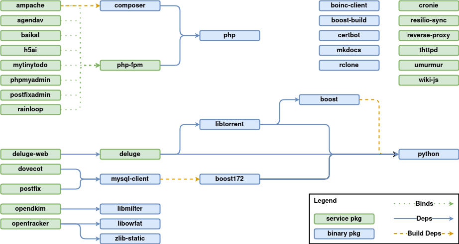

## rsertelon-plans

These plans are for [Habitat](https://habitat.sh) a packaging system for applications.

Pull requests are welcome, however, you must agree with the [UNLICENSE](http://unlicense.org) by [signing off your commits](https://elinux.org/Developer_Certificate_Of_Origin)

## Maintenance

This repo contains plans that I created with me as the final user. There are not guarantees that their config will change/break in the future. Use them at your own risks.

## Dependecy graph

When base plans refreshes occur, we need to rebuild all of our packages to include the newer dependencies.

This has to be done in order, from the packages that depend only on ` core/xxx` packages to those that depend on other `rsertelon/xxx` packages.

Graph of dependencies (core packages are _not_ mentioned on purpose):

[](https://viewer.diagrams.net/?tags={}&highlight=0000ff&edit=_blank&layers=1&nav=1&title=rsertelon%20plans%20dependencies#R7V1dk6I4FP01PjolCR%2F62Hb3ztbszNZUzcPsPkaImm0kDMRW%2B9dvUFDJ1W6aBoIDVV3VJmA0Oefc3HsT4gDfr7afIxIuv3GP%2BgM08rYD%2FDBAyEAIDZK%2FkbdLawzTONQsIualdaeKH%2ByFppWjtHbNPBrnbhSc%2B4KF%2BUqXBwF1Ra6ORBHf5G%2Bbcz%2F%2FqSFZUFDxwyU%2BrP3JPLE81I6Rc6r%2Fk7LFMvtkw54crqxIdnPak3hJPL45q8KPA3wfcS4Or1bbe%2Bono5eNy%2BF9f1y5evxiEQ1EkTfM%2Fg7vvc%2BPf72E5Av%2F%2BfOL6ayN4Tj9cs%2FEX6c9HiCbrMIBngazOPknr36lCxp4aTfELhubiK8DjybNj%2BR9myUT9EdI3OTqRtJB1i3FypclQ76c80Ck8BpYlmMR8afjmKLkDub799znkSwHPJB3TonPFoEs%2BnQu%2Bzh9ppFgEpu7tFrwMGs5%2FVbpqCQ30u3VgTKOwy%2BJS%2FmKimgnb0nf4IzSQUk5a2aQbk4EwNk9y3Pws0qSkm5xbPuEi3yRQvMOmAyAEkkQIc%2BvYGIUwORsxAcIexYde%2BYRm7MrYzTDtg3GugiqFQAyzuNhZLbhDA8DXcAD1QUHhnCs5CAvaRfhGOtGw7xkwvzEXnjsOQeH%2FWudWNv9MA3j%2FTjdyRsMHG73Q5Ndl68Wyf8ZYU%2FEz1qTX27f4OFaF6E2TN1YWwDrGWeBO3R9lnSpUkwIHc%2FdS5jY7pjO5rowcVDL9GdfwITH3QDDVhSCLvgKzaLhXEZjOFsz%2FzUX7vfBRBWIfn9hfBkTw0GdAMRURGIi3SKZAEBc2cEZ74bRAgLRPq1nCj0HhK9CHtOoE4i0zqc2YMTpRjxgHYlwWgcHAnB41F8vugGHqg7s6J4%2FDJgBOOAx3NBZJzBpHyQwDeDxZ%2BpWPaffBh7mSDseMFRfWoR1EQzD0T5%2FwBjdZ7MV80VHHSxzrF0fMFCXkPDNnHQjCFERsQztiMAwXSIieBR1JbWoBupYPyYwUl89edyNO4EHCNS1TyRZw%2Bd47OJffpcS8GAu0Z7OQjBaX%2B0EC3aCe7yLHhcaaRcKjNh5SAPvia26CIh%2BfwvBkD0BRETEfaraCb4NTPR7XAjG7OEy7MQkorpa%2BnPwCAbsEozhPOyGwWrhFAKDdgnIake8FQs6gYkKCdYOCQxHQh6LOdt2EQ%2FT1D2BYBiOpHh0VyS2bpFgGI2EO7HkFcPR0oldXTvUvzKCYSgSERb4nFfsat2IQLSHIhiGIhGNmc%2F4MN4FbjdAad%2BmbhiMRK6fPIfQBbOlphr1u78YxiMRlX2M6TCM%2BHbXTZloDxMxjErEUojQ6yYe2jPyGK4jrlfrSP51EpAW2C24jLhhT2z4X8VrVrcCiPagHcOg%2FcVns2EsiGAVe1stnd1B6ld75J7NY7mnthQkaODdJY%2FwypLrkzhmbn7wqbeg2VDySEaYCx4Q%2F%2FFUO6VbJv7J7pav%2F5WvR5%2BstPSQjM4oK%2ByyQiD798954exdSfH0tn0pe19ZYJNevA6rHBS%2Bjlz6ynCmNkeQaEHFa1q4wpMzHlgXaJDVRdSXmnnOf99L3Eg%2F4TtnyaLwkYaTK6FY1sShn%2Bm7TgwDDan7c22lncM4gHb2TD32%2BgPkhRmO95O3QWq%2BLZT32zFIZ9njlO%2B4gBy6R35HnRhLkh%2Bru0JUFdXNfphPqsF0eyReHmfhRu14XgrzObXdi1LwnMlsNGqXFHBBKRyyLbqkgA2FwerBCYWlYCt%2BjdJO3UqAibxuKyHP%2BwtHfDSnBPsmJgWs5hMmJScFEysNmQ1PCpdOYeil0AopZP7Cm1oYa5WCYsvN7Imed0tBmV2wrTRUtxRg4rpuKSSF70QIGgX7GjQy9QqkQHbqBr2mwxYpbQGErQYQZb0m1f0aN%2Bw2wSWEXiCtFkh28l7LBaKmntXsZWGBqM6U07BA4JpODQLRyf6byi8ZRf2nw37mtkTVx%2FJHo%2BrjxNMU%2FeEKWk9%2FjfRHBelvaI4fzDz9R2VDaSPfELIaDqXhemVP%2Fxugv%2B5M0iRPf6d0JklpCDVL%2F2w8evq3g%2F6FlxSQVvori2KlrT9Wl%2Bkatv5WFWvLPf0ro79ZkP5nZ7rroL8SsWI1%2FV%2BY%2FmoMrS5I1E1%2F1NO%2FTfQvurfC1sp%2BEPmWZT%2BIfBtmfyMLyj37q2a%2FXtffVFwWS3VZitLfUpwoS3Wi6qZ%2FI4vIPf0L0j8b%2Fbddf73W36rI9TdHml3%2FRhaOe%2FoXpX%2FhyNdpk%2FXHZfeVqtYf7M6um%2F6NLAv39K%2Ba%2Fge%2B6aK%2Fpf5aV9nI11KnkaYj337Rt1X0twrSX%2B%2BiL%2FhtDXUvT2H6KxkkU91dVDf9%2B0XfVtF%2FUpT%2BrXqSwFETNmUzP46aQqqb%2Fo0s%2BvZ74qpTSOGFAb174hSzXnrTKDjUvuFNo5k%2Be4HcikCMwh6UXoWYqkKskgqZqApRGqpbIY2sHPcKqdDJupF91apCyu6rBgppeF%2B1jXqF3JhCij7G2TKFlD3YApyQoSZz61ZI80809wr52LNrhR9O0KsQJbsKdlaUfjan6Tik%2BQede4V8TCHoNhSimn67ZByC1cnIaDYOyX7V%2BkwhMY2emQRJAvi0AHL5HY%2FBc5TE5HErjb4fhodT%2B4wFZP%2BlK0elpefgAVSwdlRau%2BWpvcsXuiz0WN1nZ4w%2FlbTRk8mbTdVtpeF62wMN4RmlCRxfyYz6ec4Rny0Sb8SV0FBJhGmiS%2BYS%2Fy69sGKet%2BdecrT5C5nt20t4FSY92vfRmg6shws8yPPkmupdHgTUFWnLg6NEz%2BnyiuSu2ojRJ5SDBlfCneNjZPlWswb4fB7TenBuy2kk7fUh22JPzHFl9uRCU3XbE7iAOWWB1wmDciVuOBkU23Zy8AxRRUbFvthsA1al%2BSNcKvBhWnRsV1tsjmVW58PApuq2OXDL3HTNfE9WdcWXubLz%2FmR6MK7KgVFOUStjXGQx4lyc3y5DyeU37iWYPP4P)